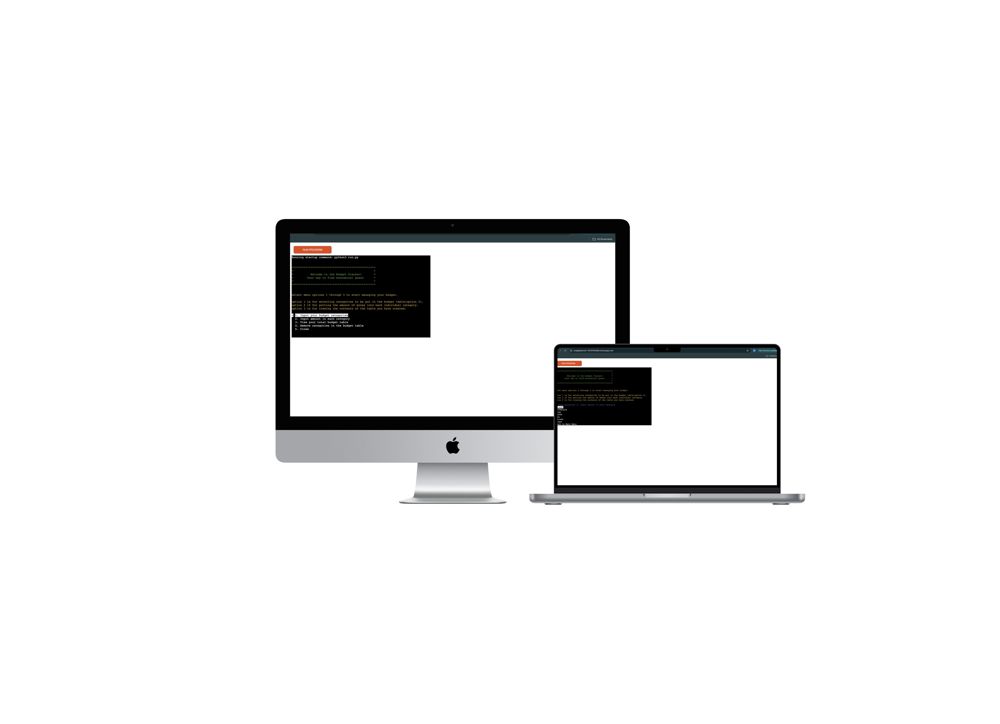
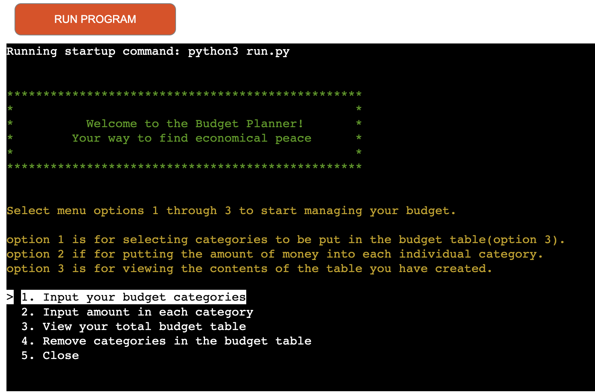
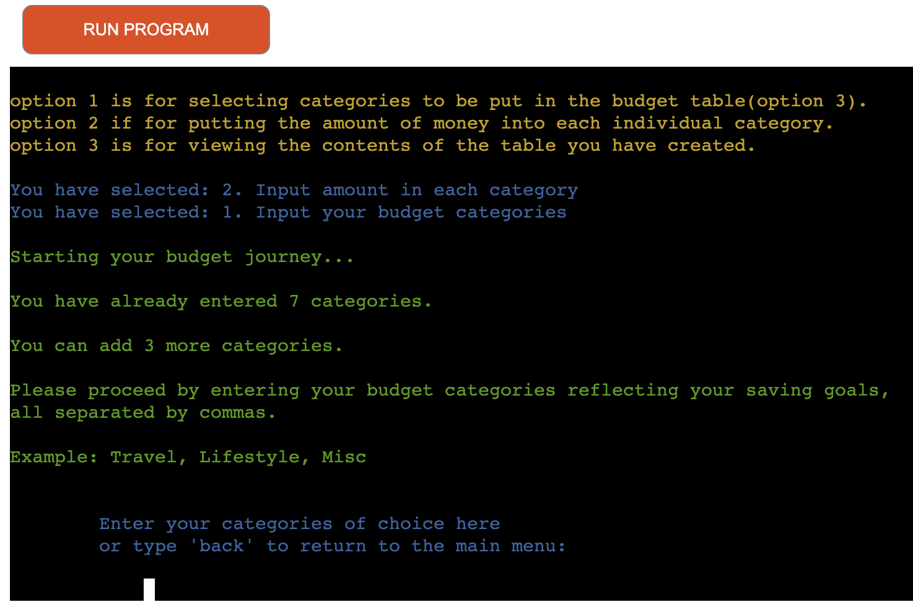
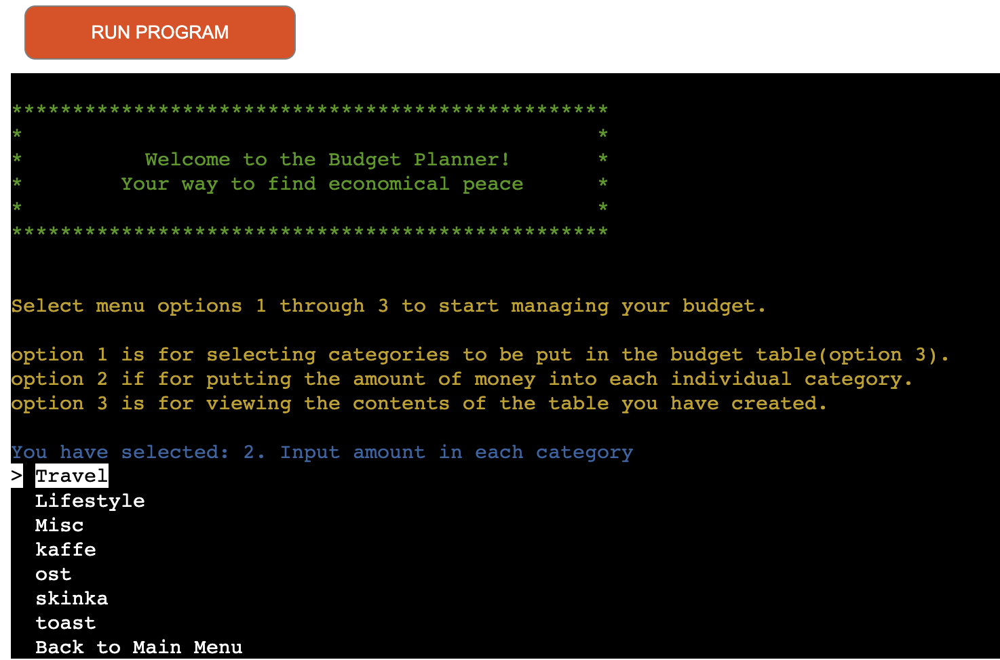
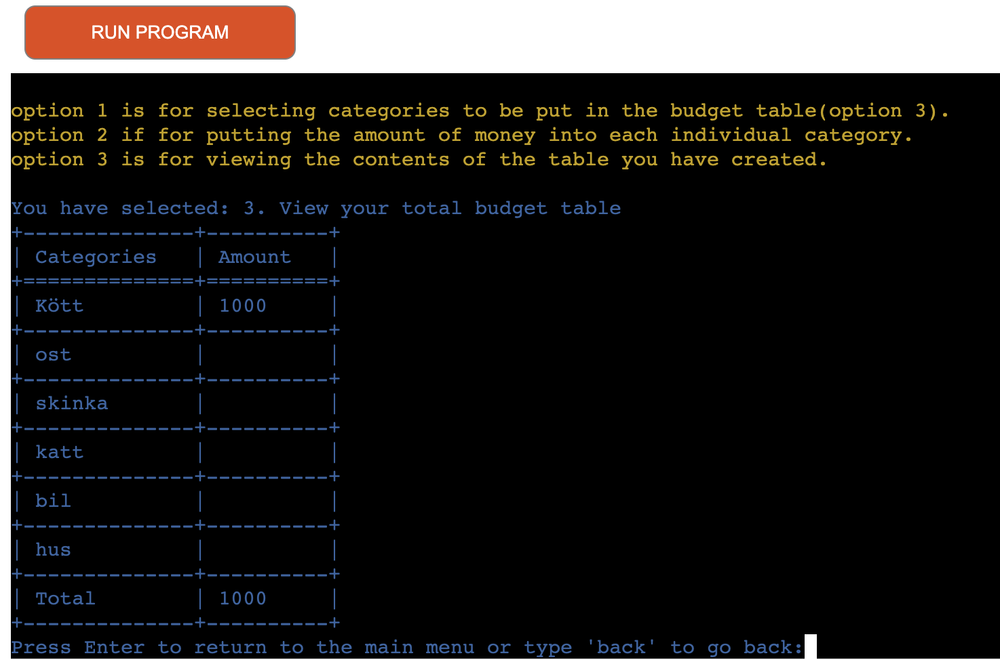
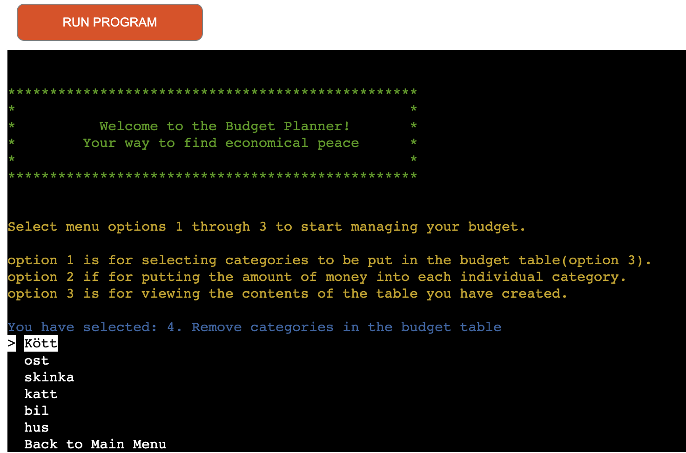
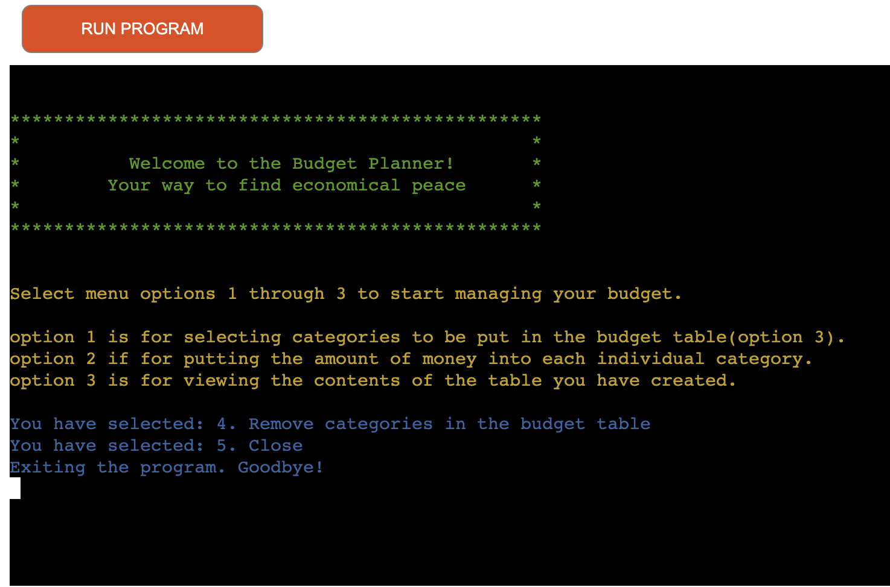
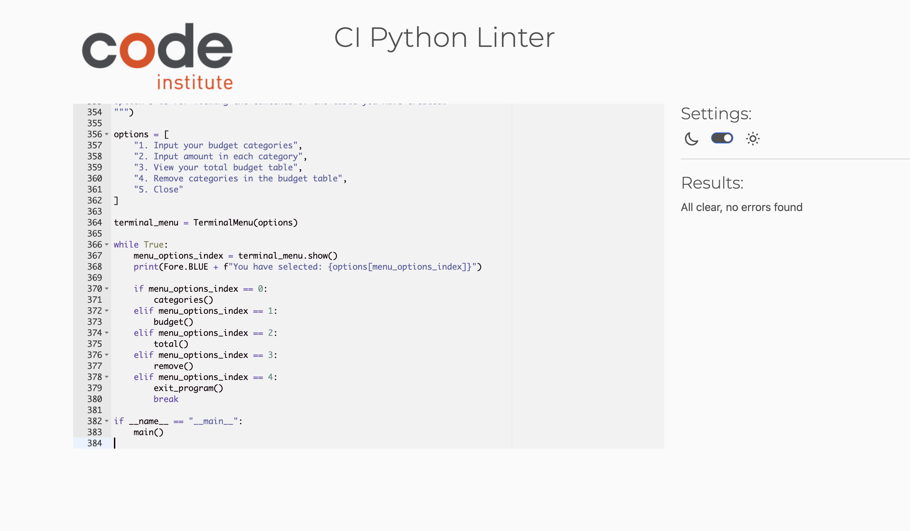

# Budget Plan



*The link to [Budget Plan](https://budgetplanner-7fa701ffc569.herokuapp.com/)*

Budget Plan is a Python terminal project which primary purpose is to help users sort their economy.

Secondarily, it allows users with diffuclty handling their money to learn and see what money they manage in real time.

The program itself is simple to use and self explanetory through its amount of functions. The menu options as well as instructions when pressed helps the user to understand the idea of the program easily.

---

## How to run:

  1. Click this *[link](https://budgetplanner-7fa701ffc569.herokuapp.com/)* or copy this text: `https://budgetplanner-7fa701ffc569.herokuapp.com/` and paste it into the search bar of your desired browser.
  1. When the program is loaded it will present you with a welcome message and options with descriptions.
  1. Option 1 lets you input categories as data into google sheets to start your budget journey, with your own goals.
  1. Option 2 lets you add and adjust the amount of money you have in each category.
  1. Option 3 lets you display the full table in a grid format so that you know exactly how it looks according to the google sheets file.
  1. Option 4 lets you remove categories from the table in a simple manner with menu options.
  1. Option 5 allows you to end the program at will.

  Link to the program: *https://budgetplanner-7fa701ffc569.herokuapp.com/*

  ---
## User Stories
### First Time Visitor Goals:

* As a First Time Visitor, I want to understand the programs purpose to easily navigate and run it as intended.
* As a First Time Visitor, I want the navigation to be as easy and understandable as possible.
* As a First Time Visitor, I want to the program to be useful and have an impact on how i view my economy.
* As a First Time Visitor, I want to see colors that align with the purpose of the text written.

### Frequent Visitor Goals:
* As a Frequent User, I want to be able to return to adjust and remove my data if needed.
* As a Frequent User, I want to be able to look at the table created by the data i put in, to see how far from my goal i am.

---

 - **When the program is loaded**

  The user can see a welcoming message and a terminal with 5 options.

    1. Input your budget categories.

    2. Input amount in each category.

    3. View your total budget table.
    
    4. Remove categories in the budget table.

    5. Close.
  
  


   - **User press option 1**

  - The user gets informed, how many categories are already inserted and how many are left to populate.

  - The user then gets instructions as to how the string should be inserted, that is "seperated by commas".

  - The user gets an example of how an input could look like.

  - The user is then prompted to input categories for the budget table or to go back to the main menu.

      


 - **User press option 2**

  - The user is presented with the categories they've created.

  - The user can adjust and add to the categories if selected.

  - The amount they choose to input either gets updated or added to one of their categories, followed by a message saying it was successful.

      


 - **User press option 3**

  - The user is shown a table of all the data they have input into the existing google sheet.

  - The table is structured in grids with headers and easy to read functionality.

  - The total is displayed in the bottom of the table.

      


 - **User press option 4**

  - The user is able to select from their previously input categories.

  - Selecting one of these will prompt them with a message if they want to remove the category.

  - If yes is pressed, the category will be removed from the table/google sheets.

      

 - **User press option 5**

  - Pressing this option, closes the program and tells the user "Goodbye!"

      

---

## Technologies Used

### Languages:

- [Python 3.8.5](https://www.python.org/downloads/release/python-385/): used to anchor the project and make all the functions run

### Frameworks/Libraries, Programmes and Tools:
#### Python modules/packages:

##### Third-party imports:

- [Simple Terminal Menu](https://pypi.org/project/simple-term-menu/) was used to implement the menu.
- [Colorama](https://pypi.org/project/colorama/) was used to add colors and styles to the project.
- [Tabulate](https://pypi.org/project/tabulate/) was used to create a table out of all the data being input.
- [Better-profanity](https://pypi.org/project/better-profanity/) was used to set a profanity filter to not use bad words on inputs.

#### Other tools:
- gspread / google.oauth2.service_account / Credentials
- Git: Version control
- GitHub: Store repository so other people can see
- GitPod / VSCode
- Heroku: Used to deploy the website online for other people to use.

---

## Bugs

+ **Solved bugs**

1. The function ```budget()``` did not add the total in to the column A of google sheets.

    - *Solutions:* The function first checks if a "Total" row already exists in column A. If it finds one, it uses that row. If not, it adds the "Total" row after the last category. The total_formula variable now stores the formula =SUM(B1:B{last_row}), which calculates the sum of all values in column B from row 1 to the last category row. This formula is then written to the "Total" row in column B.

    ```
        total_row = None
    for i, cell in enumerate(first_budget.col_values(1), start=1):
        if cell.lower() == "total":
            total_row = i
            break

    if not total_row:
        total_row = len(categories) + 1
        first_budget.update_cell(total_row, 1, "Total")

    last_row = len(categories)
    total_formula = f'=SUM(B1:B{last_row})'
    first_budget.update_cell(total_row, 2, total_formula)

    print(Fore.GREEN + f"""
    The total budget has been updated. 
    You can view the total at the bottom of the categories in your Google Sheet.
    """)
    ```

1. The function ```categories()``` did not allow me to enter 3 categories if 6 categories was already entered.

    - *Solutions:* By removing the cap of 3 categories which made sense in the beginning, i could now bypass any restriction of minimum categories up to 10 like it was intended.

    ```
     try:
        if total_categories > 10:
            raise ValueError(Fore.RED + f"""
    Maximum 10 categories allowed; you have provided {len(new_categories)}"
    and the total would be {total_categories} (excluding the total row)."
            """)
        return True
    except ValueError as e:
        print(Fore.RED + f"Invalid data: {e}, please try again\n")
        return False
    ```

1. The function ```budget()``` did not add the total to the end of the column like last time. This time it was due to me creating a variable and then changing it. 

    - *Solutions:* By not naming the variables 2 times i solved the problem, which more more likely a "glitch" than anything as no matter how much i searched for this error, it did not become appearent.

    ```
    row_range = first_budget.range('A1:A10')
    categories = [
        cell.value for cell in row_range 
        if cell.value and cell.value != "Total"
    ]
    ```

+ **Unsolved bugs**

    - The budget function still causes the total to not be displayed sometimes.

    - The categories function does sometimes not update the columns correctly or it misscounts how many inputs has already been made.

---
## Testing

The program has through its development been tested regurarly to make sure there is as little bugs as possible. Though there are still bugs present but the core code itself is very well formed. This is shown in the validator testing as well.

| feature | action | expected result | tested | passed |
| --- | --- | --- | --- | --- |
| Menu option 1 | Clickable option | When button is pressed, user is directed to the categories section | Yes | Yes |
| Entering categories | input | When the user input a category, does it work and does it display the correct error code if it does not work? | Yes | Yes |
| Menu option 2 | Clickable button | When button is pressed, user is directed to the insert amount section | Yes | Yes |
| entering amount | input | When the user input an amount into a category does it work and does it display the correct error code if it does not work? | Yes | Yes |
| Menu option 3 | Clickable button | When button is pressed, user is directed to the total table section | Yes | Yes |
| Table view | view table | Does the table view correctly and does it display the total? | Yes | Yes |
| Menu option 4 | Clickable button | When button is pressed, user is directed to the remove categories section | Yes | Yes |
| Remove categories section | Clickable button and input | When pressed does it let the user choose which category to remove and does it display the correct error message if not? | Yes | Yes |
---  

### Validators



- Passed without any errors!

---
## Deployment

---
## Credits
- I want to credit heroku for hosting the program. [Heroku](https://www.heroku.com/)
- The color formatting from: [Colorama](https://pypi.org/project/colorama/).
- The menu options from: [Simple_Terminal](https://pypi.org/project/simple_terminal/)
- The table from: [Tabulate](https://pypi.org/project/tabulate/)
- The profanity filter from: [Better_profanity](https://pypi.org/project/better-profanity/)
---
## Acknowledgements
- My mentor for feedback and help!